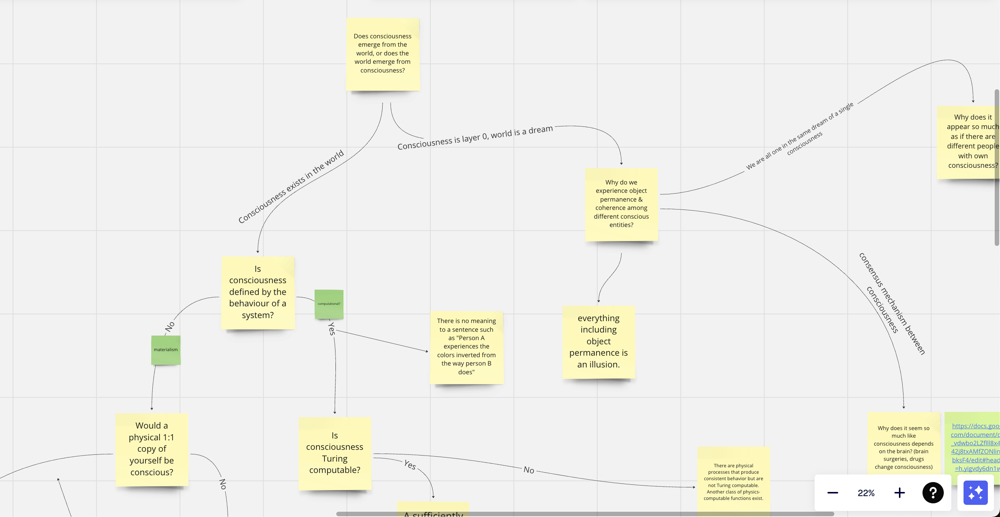

# thoughts
I write down random thoughts I have, mostly for myself but if anyone is interested also for them.

- [What is reality?](reality.md)
- [Do we live in a simulation?](simulation-theory.md)
- [Can a movie be sentient?](sentient-movie.md)
- [What are emotions?](emotions.md)
- [Different metaphors to describe our universe](different-metaphor-same-model.md)
- [Arbitrary boundaries of definitions in a fluid world give a wrong impression of discrete things](discrete-concepts-in-a-fluid-world.md)
- [Qualia probably doesn't require that much intelligence or self-awareness](does-qualia-require-self-awareness.md)
- [How crazy information flow between humans changed](information-network.md)
- [When an AI would convince me that it is self-aware](self-aware-ai.md)

## todo
- science, utilitarianism and the missing gap of objective levels of happiness and suffering
- longtermism - if we assume there is a minimal chance x of everything dying per year, then we should use `(1-x)^t` as a discount factor in our utility function, exactly how it is done in reinforcement learning. Therefore, future utility is likely not as vast.
- utilitarianism: is the ethics with the least arbitrary assumptions - how would you act if you would experience the universe from the perspective of everyone and everything one after the other
- non-discrete computations - can we say the universe is computational if time is continous? Can we define a computational model for non-discrete inputs, outputs and states?
  - turing machine has a transition function that computes a sequence of discrete states. We want a transition function that computes states at non-discrete points in time, and therefore need to define the transition as state change wrt to the state index `t`. The transition function would be a differential equation
- [the 'what is consciousness' miro board](https://miro.com/app/board/uXjVMtbLEJw=/?share_link_id=755750042563)
  

