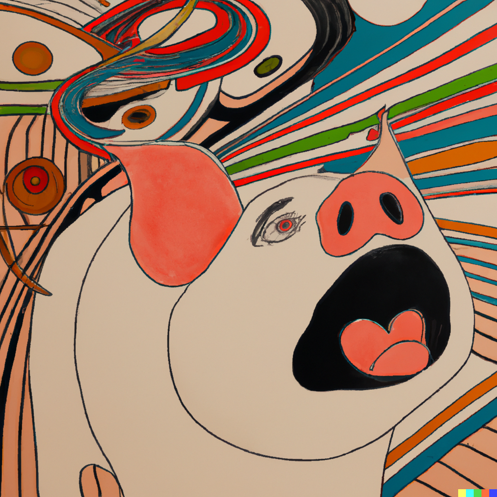

# Qualia probably doesn't require that much intelligence or self-awareness

There is a popular believe that qualia emerges as a side effect of intelligence, consciousness or self-awareness.
From wikipedia: In philosophy of mind, qualia are defined as individual instances of subjective, conscious experience.
A particularly interesting property of qualia are that they can be good/pleasant or bad, and as a utilitarian I basically want to maximize the good qualia that exists, so finding out what has it and what not has huge implications.

The relationship of self-awareness and qualia is not entirely clear to me yet, but I believe that qualia can exist without self-awareness.
Self-awareness is much easier to define: an agent that has a model of the world which contains a model itself is self-aware. Joscha Bach defines consciousness as a model of the own attention, basically being aware of its own awareness.

Self-awareness and consciousness are both hard to test in an adversarial setting.
Imagine a super intelligent agent would create a number of objects with the intention that you cannot figure out which of them are processing information in a way that results in them modeling the world, themselves and their own attention - then it would be really hard to identify these objects from other objects.
It is very hard or maybe impossible to proof that a physical system is not doing that.

On the other hand, for a machine learning model that is delibaretly built to model the world, itself as part of the world and so on, it would be quite possible to proof that it has developed abstract concepts that relate to its own attention model, and by Joscha Bach's definition the system would be conscious.

I am still not convinced that this is the same as the subjective experience of existence, or that self-awareness and consciousness are required to be in a happy or in a suffering qualia.
If you have ever had a nightmare or an intense trip or meditated very successfully, you have been in happy or unhappy states of mind in a time where your brain did not model itself as part of the universe and certainly did not model or regulate its own attention. A moment in which your body is flooded by happy hormones feels happy, but you don't reflect on who you are in relationship to the universe or think anything else that relates to your self or your own attention. It feels more like happiness or suffering is a phenomenon that is happening in the body or very self-unaware parts of the mind.
Therefore I believe that the ability to experience emotions does not require very high levels of intelligence or self-awareness. Unfortunately, I also don't know under what objectively definable conditions happiness or suffering occur.
